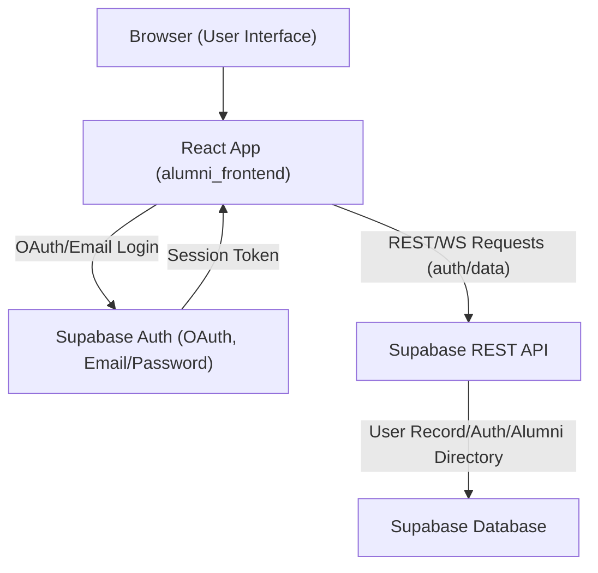
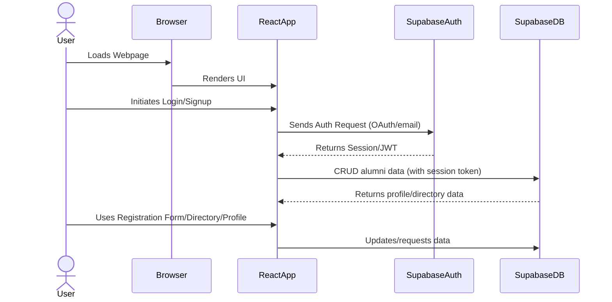

# Technical Design and Architecture Document
**Alumni Registration and Directory Platform — Frontend (alumni_frontend)**

---

## 1. Overview

This document details the architecture, technology decisions, and major frontend design choices for the Alumni Registration and Directory Platform’s user-facing interface (`alumni_frontend`). This React web application will enable alumni to register, authenticate (using Google, LinkedIn, or email), search a secure directory, and manage their own basic profiles. The frontend is designed for seamless integration with a Supabase backend, leveraging modern authentication and database services via environment configuration.

---

## 2. Technology Stack

- **Frontend Framework:** React 18+
- **Styling:** Vanilla CSS with design tokens/variables for theme (light/dark). No heavy UI frameworks are used.
- **State Management:** React's internal state/hooks (no Redux or Context currently used).
- **Build Tooling:** react-scripts (Create React App)
- **Testing:** react-scripts test (Jest/react-testing-library)
- **Linting/Quality:** ESLint with React and JS plugins
- **Authentication & Database:** Planned integration with Supabase (OAuth, email/password)
- **3rd-Party Auth Providers:** Google, LinkedIn (planned, via Supabase Auth)
- **Configuration:** .env files to provide environment variables:  
  - `REACT_APP_SUPABASE_URL`
  - `REACT_APP_SUPABASE_KEY`
- **Browser Support:** Modern desktop and mobile browsers, responsive UI

---

## 3. High-Level Architecture

The alumni frontend is a modern Single Page Application (SPA) organized as follows:



- The React SPA runs in the browser, providing all user interfaces.
- All backend interactions (auth, registration, directory queries, profile updates) are managed through Supabase's REST API and authentication modules.
- User sessions and tokens are handled via Supabase's authentication SDK, leveraging OAuth (Google/LinkedIn) or email/password.
- Directory and profile data is persisted in the Supabase managed PostgreSQL database.

---

## 4. Component Structure and Data Flow

### 4.1. Planned Component Hierarchy

Due to the lean state of current implementation, the following major React components are proposed:

- **App:** Application shell—manages global theming, navigation, and routing.
    - **Navbar:** Links to Home, Directory, Login/Register.
    - **AlumniRegistrationForm:** Handles alumni registration fields (name, branch, batch, reason).
    - **AlumniDirectory:** Displays/searches through alumni list, only for authenticated users.
    - **UserProfile:** Allows profile management, visible after login.
    - **AuthProvider:** (Planned integration) Wraps the app providing auth state and logic.
    - **Login/Signup Components:** OAuth (Google, LinkedIn) and email/password flows.
    - **AdminPanel:** (Potential future extension for university staff.)

### 4.2. Data Flow and Auth



- Users authenticate using OAuth (Google/LinkedIn) or email/password via Supabase, retrieving a session token.
- All profile and directory actions occur by secure API calls to Supabase, with the session token attached for authorization.

---

## 5. Authentication Strategy

- **OAuth Providers:** Google and LinkedIn buttons (using Supabase Auth).
- **Email/Password:** Standard form with Supabase-powered signup/login and email verification.
- **Session Handling:** Auth state is managed by Supabase’s JS SDK; the session JWT is used on requests for data access control.
- **Protected Routes:** Directory and profile management pages require authentication, using auth guard logic in components or routing.

---

## 6. Supabase Integration Details

- **Supabase Client:** The application will import and initialize the Supabase client library, reading the URL and key from environment variables (`REACT_APP_SUPABASE_URL`, `REACT_APP_SUPABASE_KEY`).  
- **Auth Flows:** Auth endpoints for OAuth and email/password provided by Supabase Auth. Password resets and email confirmations are handled by Supabase.
- **Database:** Alumni registration info, profiles, and directory entries are stored in the Supabase PostgreSQL DB, exposed via Supabase REST endpoints.
- **Security:** All write/read operations performed client-side are restricted to authenticated users based on Supabase's row-level security (RLS) policies.
- **No current direct Supabase code exists; integration is a planned next step.**

---

## 7. Frontend Project Structure

```
alumni_frontend/
  src/
    App.js         # App shell, theming, entry point
    index.js       # ReactDOM bootstrapping
    App.css/index.css # CSS, theming
    ...            # (future components: Registration, Directory, Profile, etc.)
  kavia-docs/
    architecture-and-technical-design.md
    business-requirements-document.md
  package.json/    # Project metadata and dependencies
  .env             # (Not committed, but expected: Supabase keys)
```

---

## 8. Rationale for Technology and Design Decisions

- **React:** Chosen for fast, maintainable SPA development with a rich component model and broad ecosystem support.
- **CSS/No UI Framework:** Keeps bundle size small, ensures design flexibility, and enables easier custom branding/themes.
- **Supabase:** Simplifies backend needs (database, authentication, email/OAuth, and API provisioning) with scalable, secure, developer-friendly infrastructure.
- **OAuth + Email Auth:** Reduces friction for alumni sign-up and future login, supports both institution and personal identities.
- **Environment-Based Config:** Allows safe separation of secrets and flexibility for deployment across environments.

---

## 9. Future Enhancements & Extensibility

- Addition of routing (e.g., react-router).
- Implementation of all major user stories (alumni registration, listing, search, profile editing).
- Integration of Supabase client SDK for auth/data.
- More granular admin roles and UI.
- Progressive enhancement for accessibility.
- Integration and unit tests for new features.

---

## 10. References

- [Supabase Documentation](https://supabase.com/docs)
- [React Documentation](https://reactjs.org/docs/getting-started.html)
- [Business Requirements Document](./business-requirements-document.md)

---

*Document generated based on project state and business requirements as of [Auto-generated: Insert current date upon implementation].*

---

```
**Sources:**  
- alumni_frontend/src/App.js  
- alumni_frontend/src/index.js  
- alumni_frontend/package.json  
- alumni_frontend/eslint.config.mjs  
- alumni_frontend/README.md  
- business-requirements-document.md  

```
